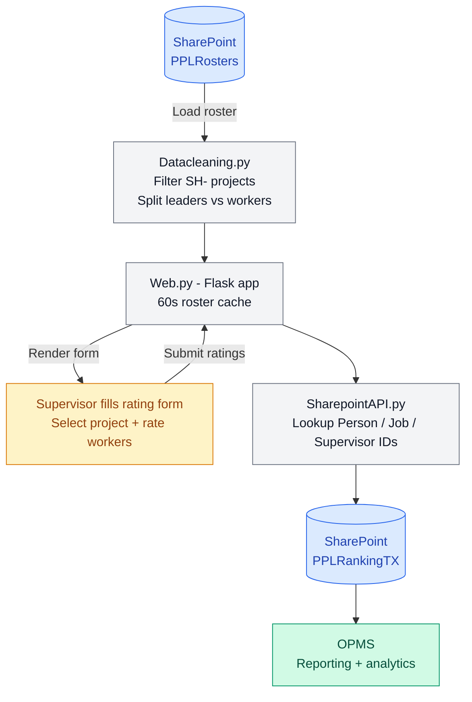

# Shutdown Rating System

A web-based rating form for shutdown workers. Supervisors select a project, choose workers from the live SharePoint roster, submit ratings, and results are written directly back to SharePoint for OPMS reporting.

## System Architecture


## Preview


## How it works

1. Supervisor opens the form — app loads live roster from SharePoint `PPLRosters`
2. Supervisor selects a shutdown project (only `SH-` prefixed projects shown)
3. Workers and leaders are split automatically by position keywords
4. Supervisor submits overall ratings and comments per worker
5. App looks up Person ID, Job ID, and Supervisor ID from SharePoint lookup lists
6. Rating rows are written to `PPLRankingTX` in SharePoint
7. OPMS reads from `PPLRankingTX` for reporting

## Data cleaning rules

| Rule | Detail |
|---|---|
| Project filter | Only `SH-XXXXX` prefixed projects included |
| Vehicle removal | Positions starting with `Z.` are excluded |
| Leader detection | Position contains: SUPERVISOR, SUPERINTENDENT, MANAGER, HSE, ADVISER, ADVISOR, COORDINATOR, SYSTEM, DATA, OPERATIONS |
| Deduplication | Same person + project + position + work type — keep one row |
| Duplicate submissions | Same token blocked for 120 seconds |

## SharePoint Lists

| List | Purpose |
|---|---|
| `PPLRosters` | Source roster — workers and leaders per project |
| `PPLPeople` | Person lookup — name to SharePoint item ID |
| `JMSJobs` | Job lookup — job code (e.g. SH-26043) to SharePoint item ID |
| `PPLRankingTX` | Destination — rating submissions written here |

## Technologies

- Python / Flask
- Azure App Service
- GitHub Actions (CI/CD)
- Microsoft Graph API (SharePoint read/write)
- pandas

## Project Structure

```
shutdown-rating/
├── Web.py                  Flask app — routes, caching, form handling
├── application.py          Azure App Service entry point
├── SharepointAPI.py        Graph API — read roster, write ratings, lookup IDs
├── Datacleaning.py         Filter, deduplicate, split leaders vs workers
├── templates/              HTML form templates
├── static/                 CSS and assets
├── requirements.txt
├── startup.sh
└── .github/workflows/      Azure App Service CI/CD
```

## Environment Variables

| Variable | Description |
|---|---|
| `TENANT_ID` | Azure AD tenant ID |
| `CLIENT_ID` | Azure AD app client ID |
| `CLIENT_SECRET` | Azure AD app client secret |
| `SHAREPOINT_HOST` | SharePoint host (e.g. company.sharepoint.com) |
| `SITE_NAME` | SharePoint site name |
| `ROSTER_LIST_NAME` | Source roster list name |
| `RANKING_LIST_NAME` | Destination ranking list name |

## Deployment

Hosted on **Azure App Service**, deployed automatically via **GitHub Actions** on every push to `main`.
