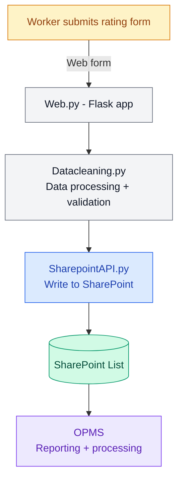

# Shutdown Rating System

A web-based rating form for shutdown workers, built with Flask and deployed on Azure App Service. Submissions are automatically written to SharePoint and consumed by OPMS for reporting.

## System Architecture



## What it does

- Workers submit shutdown ratings through a web form
- Data is validated and cleaned automatically
- Results are written directly to SharePoint
- SharePoint data is consumed by OPMS for reporting and analysis

## Technologies

- Python / Flask
- Azure App Service
- GitHub Actions (CI/CD)
- SharePoint API
- pandas, requests, openpyxl

## Project Structure

```
shutdown-rating/
├── Web.py                  Main Flask application
├── application.py          Azure App Service entry point
├── SharepointAPI.py        SharePoint read/write integration
├── Datacleaning.py         Data processing and validation
├── templates/              HTML form templates
├── static/                 CSS and assets
├── requirements.txt
├── startup.sh
└── .github/workflows/      Azure App Service deployment
```

## Data Flow

1. Worker opens the web form — app loads latest data from SharePoint
2. Worker submits rating
3. Backend validates and cleans the submission
4. Data is written to SharePoint list
5. OPMS reads from SharePoint for reporting

## Deployment

Hosted on **Azure App Service**, deployed automatically via **GitHub Actions** on every push to `main`.

## Notes

- Designed for internal operational use
- Loads latest SharePoint data on form open
- Can be extended for additional shutdown workflows
